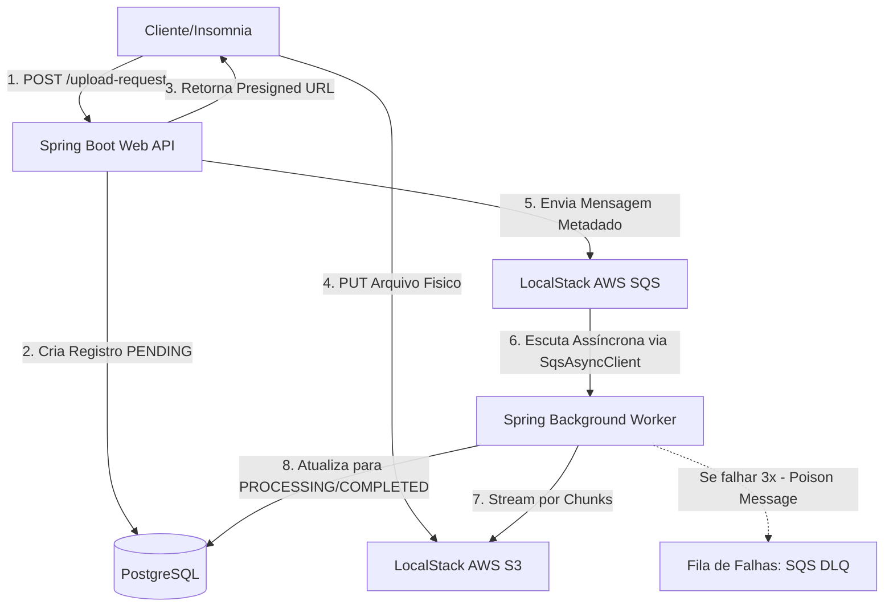

# Asynchronous File Processing Pipeline API

[](https://spring.io)
[](https://docker.com)
[](https://postgresql.org)

Uma API corporativa assíncrona, altamente resiliente e orientada a eventos, desenvolvida em **Spring Boot 4.1.0** e **Java 21**. O ecossistema foi projetado para resolver o problema clássico de esgotamento de memória (Out-Of-Memory) e *timeouts* HTTP durante o upload e o processamento de arquivos massivos (como grandes planilhas CSV).

---

## 📐 Arquitetura da Solução e Decisões de Engenharia

O sistema aplica os conceitos de **Sistemas Distribuídos e Arquitetura Orientada a Eventos (EDA)**, desacoplando completamente a recepção do arquivo da sua leitura física.



### 🧠 Padrões Avançados de Resiliência Aplicados:
1. **Upload Direto via Presigned URLs**: O servidor HTTP da API nunca recebe o stream do arquivo pesado. Ela apenas emite uma credencial temporária assinada pelo S3. O cliente faz o upload direto para a nuvem simulada, poupando a memória RAM da aplicação.
2. **Processamento não-bloqueante por Streams (Chunks)**: O `FileWorker` assíncrono utiliza `ResponseInputStream` e `BufferedReader` para ler o arquivo baixado do S3 linha por linha. Isso garante que um arquivo de vários gigabytes ocupe apenas poucos megabytes de memória durante a execução.
3. **Isolamento de Mensagens Tóxicas (Dead Letter Queue - DLQ)**: Caso o arquivo esteja corrompido ou ocorra um erro de negócio, o Spring rejeita a mensagem. O SQS tenta reprocessar até 3 vezes (política de *Retry*). Se o erro persistir, a mensagem é movida para uma fila de auditoria (`minha-fila-dlq`), impedindo o travamento da fila principal.

---

## 📊 Estrutura de Observabilidade & Telemetria

O projeto expõe e consome métricas nativas do ecossistema de produção usando **Micrometer**, **Prometheus** e **Grafana** (Dashboard ID `4701` corrigido para o Spring Boot 3.x/4.x):

* **HTTP Requests**: Gráficos de monitoramento de tráfego por segundo e taxa de sucesso baseada nas rotas executadas.
* **JVM & Thread Pooling**: Acompanhamento em tempo real do uso de memória Heap da JVM e comportamento do Garbage Collector durante a execução do Worker.
* **Logs Estruturados**: Logs técnicos enriquecidos com chaves de contexto como `fileId` e `traceId` para auditoria rápida.

---

## 🛠️ Stack Tecnológica

* **Linguagem:** Java 21 (LTS)
* **Framework:** Spring Boot 4.1.0
* **Banco de Dados:** PostgreSQL 16 (Gerenciado via Hibernate com `ddl-auto=update`)
* **SDK Cloud:** AWSpring / Spring Cloud AWS Starter S3 & SQS (v4.0.0)
* **Infraestrutura Local:** Docker & Docker Compose
* **Simuladores Cloud:** LocalStack (Simulação local de AWS S3, SQS síncrono e SQS assíncrono)
* **Ferramentas de Carga e Métricas:** K6, Prometheus e Grafana

---

## 🚀 Como Executar o Ambiente Completo

### Pré-requisitos:
* Java 21 e Docker instalados na máquina hospedeira.

### 1. Subir a Infraestrutura de Contêineres
Na raiz do projeto (onde está o `docker-compose.yml`), execute o comando para subir o PostgreSQL, LocalStack, Prometheus e Grafana:
```bash
docker compose up -d
```
*O LocalStack executará o script `init-aws.sh`, criando dinamicamente o bucket S3, a fila principal do SQS e a fila de DLQ.*

### 2. Executar a Aplicação Spring Boot
Execute o projeto através do terminal ou pela sua IDE:
```bash
mvn spring-boot:run
```

---

## 🧪 Roteiro de Testes e Validação de Resiliência

### 🟢 Cenário 1: Fluxo de Sucesso de Arquivo Real
1. No **Insomnia**, faça um `POST` para `http://localhost:8080/api/v1/files/upload-request` com o JSON:
   ```json
   { "fileName": "usuarios_producao.csv" }
   ```
2. Copie a `uploadUrl` retornada (Status `202 Accepted`).
3. Crie uma requisição **`PUT`**, cole a URL copiada, mude o tipo de corpo para **`File`**, selecione um arquivo `.csv` real da sua máquina e clique em **Send**.
4. **Resultado**: O banco PostgreSQL registrará o status `COMPLETED` e os logs da IDE mostrarão o Worker lendo as linhas do arquivo por stream.

### 🔴 Cenário 2: Ativação da Fila de Falhas (DLQ)
1. Faça o mesmo processo do cenário anterior, mas envie o nome do arquivo contendo a palavra **`corrompido`** (Ex: `dados_corrompidos.csv`).
2. Faça o upload via `PUT`.
3. **Resultado**: O Worker lançará uma `IllegalArgumentException`. O console exibirá as 3 tentativas automáticas do SQS e o silenciamento logo em seguida. Acesse `http://localhost:4566/000000000000/minha-fila-dlq` para ver a mensagem isolada com sucesso.

---

## 🖥️ Portas e Ferramentas de Acesso Local

* **Grafana Dashboards:** [http://localhost:3000](http://localhost:3000) (Acompanhe a flutuação das threads e memória durante os uploads).
* **Prometheus Targets:** [http://localhost:9090/targets](http://localhost:9090/targets) (Valide a saúde do scrape do Spring Boot Actuator).
* **LocalStack Endpoint:** [http://localhost:4566](http://localhost:4566)
